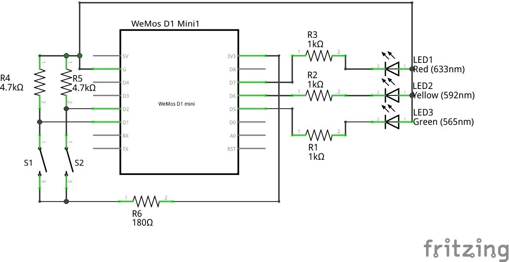

# Traffic Light
## About
A simple traffic light made out of 3 LEDs with the matching colors of a traffic light which are controlled by a D1 mini. This also means that it can be controlled externally via a web server not only by few buttons which only grants restricted access to light control.
## Schematic (Circuit Diagram)

